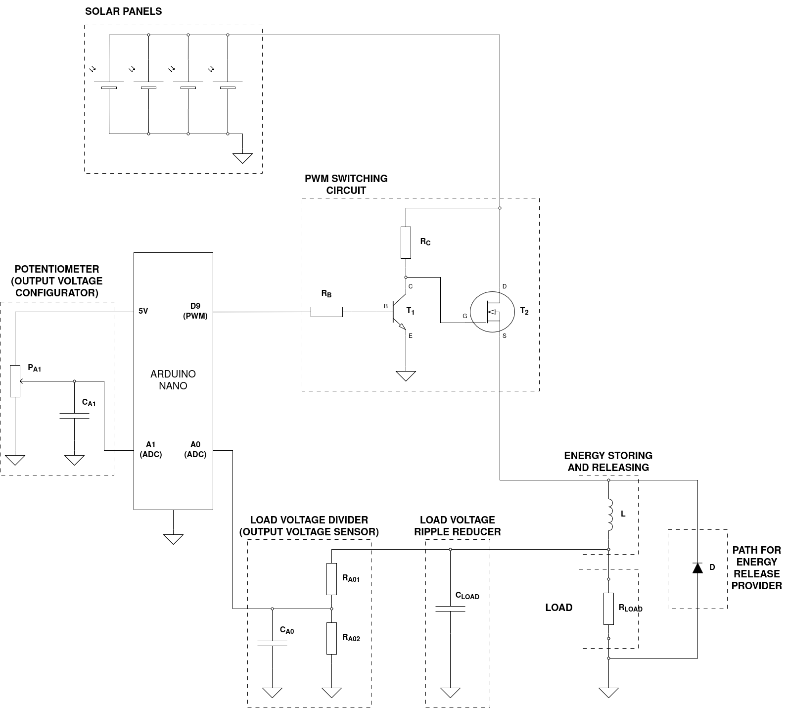
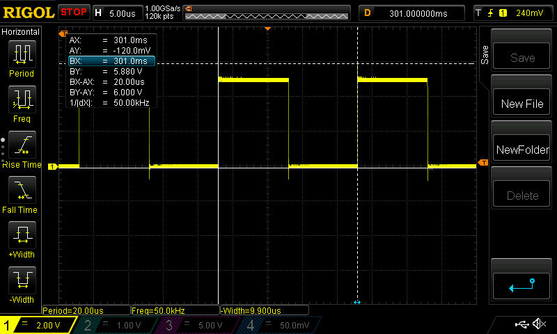

# PWM BUCK UPRAVLJAČ

PWM [buck pretvarač](https://en.wikipedia.org/wiki/Buck_converter) se koristi za pretvaranje višeg istosmjernog napona u niži istosmjerni napon. Osnovni dijelovi su mu:

- tranzistorska sklopka (najčešće MOSFET)
	- upravljana uz pomoć PWM signala mikroupravljača, propušta struju iz izvora napajanja
- zavojnica
	- skladišti energiju kada je tranzistorska sklopka uključena i ispušta je kada je tranzistorska sklopka isljučena
- dioda
	- pruža put za struju iz zavojnice kada je tranzistorska sklopka isključena
- kondezator za izravnavanje napona
	- stabilizira izlazni napon

Potrebno je ispravno odabrati vrijednosti komponenata prilikom izgradnje buck pretvarača.

